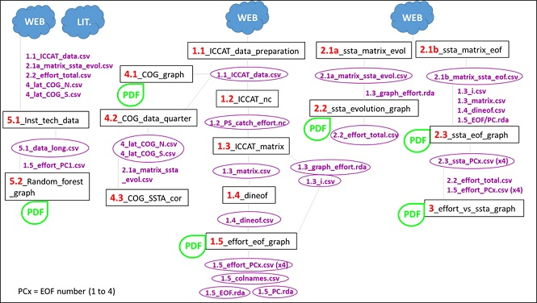

# tropituna_fishery_change

## Description

This repository allows to replicate results from the article XXX. The scripts follow a linear workflow from scripts starting by 1 to 5 (Figure 1):

* Scripts starting with a 1. They correspond to the ICCAT catch and effort data preparation and the empirical orthogonal functions (EOF) analysis of effort anomaly (effotA) (article Figure 3).

* Scripts starting with a 2. They correspond to sea surface temperature anomaly (SSTA) data preparation for temporal evolution analysis (also for effort evolution analysis, article Figure 1) and EOF analysis of SSTA (article Figure 3).

* Script number 3 correlates temporal structures of effortA and SSTA from EOF analysis.

* Scripts starting with a 4 produce center of gravity (COG) analysis (article Figure 2).

* Scripts starting with a 5 produce random forest analysis (article Figures 4 and 5).

**Figure 1. Scripts workflow.** Script titles appear inside black boxes, data created in each script and needed for the next script appear in purple and green PDF bubbles indicate that the script produces Figures included in the article. Blue bubbles indicate the source of the data used (web or literature). Number of files producedthat are higher than 1 appear inside brackets.

